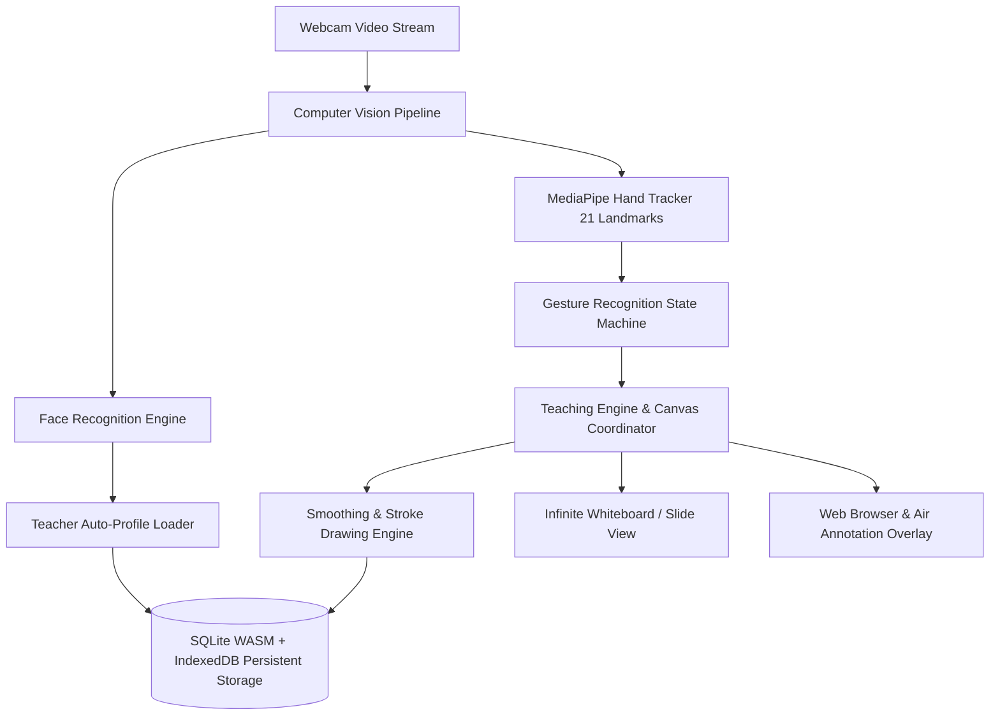

# TÀI LIỆU KIẾN TRÚC HỆ THỐNG — AIRTECH AI

## 1. TỔNG QUAN KIẾN TRÚC

AIRTECH AI là ứng dụng Desktop được thiết kế theo nguyên tắc **Local-First & Privacy-by-Design**, đảm bảo toàn bộ quá trình tính toán thị giác máy tính, phân tích cử chỉ, quản lý bài giảng và lưu trữ cơ sở dữ liệu diễn ra hoàn toàn trên thiết bị của giáo viên mà không cần bất kỳ máy chủ phụ trợ nào (Serverless Desktop Architecture).



---

## 2. CHI TIẾT CÁC MODULE CỐT LÕI

### 2.1. Camera & Vision Pipeline (`src/camera/`, `src/face/`, `src/hand/`)
- **CameraEngine**: Quản lý `MediaStream`, tối ưu hóa độ phân giải (720p/1080p), tốc độ khung hình 30 FPS, và lật gương (mirroring) tự nhiên cho giáo viên.
- **HandEngine (MediaPipe Hands)**: Trích xuất 21 điểm mốc 3D bàn tay với độ trễ thấp (< 15ms).
- **FaceEngine**: Trích xuất đặc trưng khuôn mặt (128D/512D Float32Array embedding), so khớp cục bộ bằng Euclidean Distance với ngưỡng xác thực cấu hình được (`threshold: 0.6`).

### 2.2. Gesture Engine & State Machine (`src/gesture/GestureEngine.ts`)
Hệ thống sử dụng Finite State Machine (FSM) kết hợp thuật toán khử nhiễu (hysteresis) và thời gian hồi (cooldown 300ms) để ngăn kích hoạt nhầm cử chỉ:

```text
[IDLE] ──(Phát hiện bàn tay)──> [TRACKING]
                                    │
    ┌───────────────────────────────┼──────────────────────────────┐
    ▼                               ▼                              ▼
[POINTING]                      [DRAWING]                      [COMMAND]
(1 ngón trỏ / Pointer)          (Ngón trỏ di chuyển)            (Fist: Erase / V: Tool switch)
```

### 2.3. Drawing Engine (`src/drawing/DrawingEngine.ts`)
- Thuật toán nội suy đường cong Bezier và làm mịn nét (Exponential Moving Average smoothing).
- Chuẩn hóa tọa độ camera sang tọa độ Canvas vô cực:
  $$\begin{cases} X_{canvas} = \frac{X_{screen} - X_{viewport}}{Scale_{viewport}} \\ Y_{canvas} = \frac{Y_{screen} - Y_{viewport}}{Scale_{viewport}} \end{cases}$$
- Hỗ trợ đầy đủ bộ công cụ: Bút viết (Pen), Bút dạ quang (Highlighter), Tẩy (Eraser), Mũi tên (Arrow), Đường thẳng (Line), Hình chữ nhật (Rectangle), Hình tròn (Circle).

### 2.4. Smart Shape & AI Recognition (`src/ai/AIService.ts`)
- **LocalAIProvider**: Thuật toán hình học cục bộ tính toán tỉ lệ khép kín, chu vi, tỉ lệ khung hình (aspect ratio) để tự động nắn chỉnh nét vẽ tay thành hình học chuẩn xác (đường thẳng, hình tròn, chữ nhật, tam giác).
- **OnlineAIProvider**: Tích hợp sẵn adapter kết nối API đám mây khi có Internet, và tự động chuyển về LocalAIProvider khi mất mạng (Offline-First Fallback).

### 2.5. Cơ sở dữ liệu nhúng (Embedded SQLite Schema)
Hệ thống sử dụng SQLite WASM thông qua thư viện `sql.js` kết hợp lưu trữ nhị phân bền vững vào `IndexedDB`:

#### Bảng `teachers`:
```sql
CREATE TABLE IF NOT EXISTS teachers (
  id TEXT PRIMARY KEY,
  name TEXT NOT NULL,
  code TEXT UNIQUE NOT NULL,
  subject TEXT NOT NULL,
  face_embedding BLOB,
  face_images TEXT,
  preferences TEXT NOT NULL,
  created_at INTEGER NOT NULL,
  updated_at INTEGER NOT NULL
);
```

#### Bảng `lessons`:
```sql
CREATE TABLE IF NOT EXISTS lessons (
  id TEXT PRIMARY KEY,
  teacher_id TEXT NOT NULL,
  title TEXT NOT NULL,
  subject TEXT NOT NULL,
  description TEXT,
  slides TEXT,
  boards TEXT,
  assets TEXT,
  created_at INTEGER NOT NULL,
  updated_at INTEGER NOT NULL
);
```

#### Bảng `boards`:
```sql
CREATE TABLE IF NOT EXISTS boards (
  id TEXT PRIMARY KEY,
  lesson_id TEXT NOT NULL,
  page INTEGER NOT NULL,
  strokes TEXT,
  annotations TEXT,
  viewport TEXT,
  created_at INTEGER NOT NULL,
  updated_at INTEGER NOT NULL
);
```

#### Bảng `sessions`:
```sql
CREATE TABLE IF NOT EXISTS sessions (
  id TEXT PRIMARY KEY,
  teacher_id TEXT NOT NULL,
  lesson_id TEXT,
  board_id TEXT,
  started_at INTEGER NOT NULL,
  ended_at INTEGER,
  state TEXT,
  actions TEXT,
  metadata TEXT
);
```
